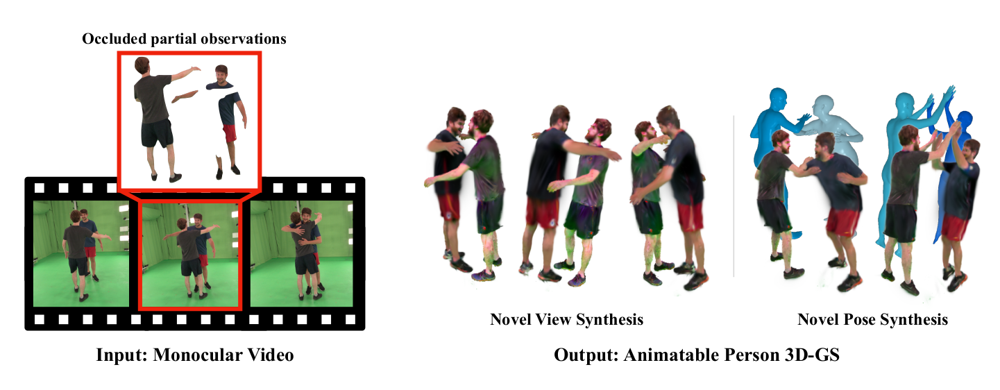

# <p align="center"> <font color=#008000>Guess The Unseen</font>: Dynamic 3D Scene Reconstruction from Partial 2D Glimpses (CVPR 2024)</p>

## [Project Page](https://snuvclab.github.io/gtu/) &nbsp;|&nbsp; [Paper](https://arxiv.org/abs/2404.14410) 



This is the official code for the CVPR 2024 paper "Guess The Unseen: Dynamic 3D Scene Reconstruction from Partial 2D Glimpses".

## News
- Jun 10 : released code
- (planned Jun 16 before CVPR) : release preprocess code of panoptic/hi4d + configs + more detailed instruction 


## Installation
Please refer to [install.md](install.md)

## Running the code
### Preprocess videos
If you want to work with in-the-wild videos, you have to preprocess by running the commands attached below.

```bash
# General preprocessing
bash -i scripts/preprocess.sh [VIDEO_FILE_PATH] [DATA_DIR] [GPU_ID]
# Simplified preprocessing (skipping occlusion mask estimation)
bash -i scripts/preprocess_simple.sh [VIDEO_FILE_PATH] [DATA_DIR] [GPU_ID]
```

For more detailed guides of preprocess, please check [preprocess.md](preprocess.md)

### Train textual inversion
For doing textual inversion, run the commands below.

```bash
# default textual inversion
bash -i scripts/train_ti.sh [DATA_DIR] [DATA_DIR]_hn 0 1 [TEST_NAME] [TI_EXP_NAME] [GPU_ID] [PORT]
```

You can skip this part if you're not planning to use SDS-loss during optimization. (when observation is enough or need fast optimization)

For more detailed guides of textual inversion, please check [inversion.md](inversion.md)


### Optimize 3D-GS (w/ SDS)
For main optimization, run the commands below.

```bash
# Optimize BG first
bash -i scripts/train_bg.sh [DATA_DIR] 0 [RESOLUTION_SCALE] [TEST_NAME] [GPU_ID]
# Optimize jointly
bash -i scripts/train_combined.sh [DATA_DIR] [DATA_DIR]_hn 0 1 [TEST_NAME] [EXP_NAME] [TI_EXP_NAME] [GPU_ID]
```

You can also optimize human avatars without modeling background gaussians using masks. (which is more general)

```bash
# Optimize without background all people
bash -i scripts/train_mask_combined.sh [DATA_DIR] [DATA_DIR]_hn 0 1 [TEST_NAME] [EXP_NAME] [TI_EXP_NAME] [GPU_ID]
# Optimize without background specific person.
bash -i scripts/train_mask_single_person.sh [DATA_DIR] [DATA_DIR]_hn 0 1 [TEST_NAME] [EXP_NAME] [TI_EXP_NAME] [PERSON_ID] [GPU_ID]

```

### Optimize 3D-GS (wo SDS) (fast)
For fast optimization, you can skip SDS loss.

```bash
# Optimize wo SDS loss
bash -i scripts/train_fast_single_person.sh [DATA_DIR] [DATA_DIR]_hn 0 1 [TEST_NAME] [EXP_NAME] [PERSON_ID] [GPU_ID]
```

### Testing

```bash
# Novel pose rendering. 
bash -i scripts/render.sh [DATA_DIR] [DATA_DIR]_hn 0 [TEST_NAME] [EXP_NAME] [GPU_ID]
```

## Ack.
This work was supported by Samsung Electronics C-Lab.


## License
Codes are available only for non-commercial research purposes.


## Citation

If you find this work useful, please cite our paper:

```
@article{lee2024gtu,
    title={Guess The Unseen: Dynamic 3D Scene Reconstruction from Partial 2D Glimpses}, 
    author={Inhee Lee and Byungjun Kim and Hanbyul Joo},
    year={2024},
    eprint={2404.14410},
    archivePrefix={arXiv},
    primaryClass={cs.CV}
}
```
